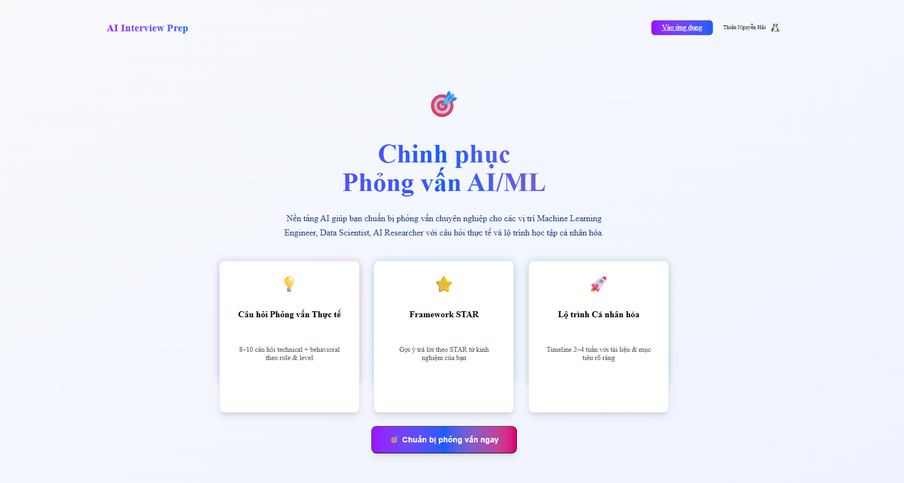
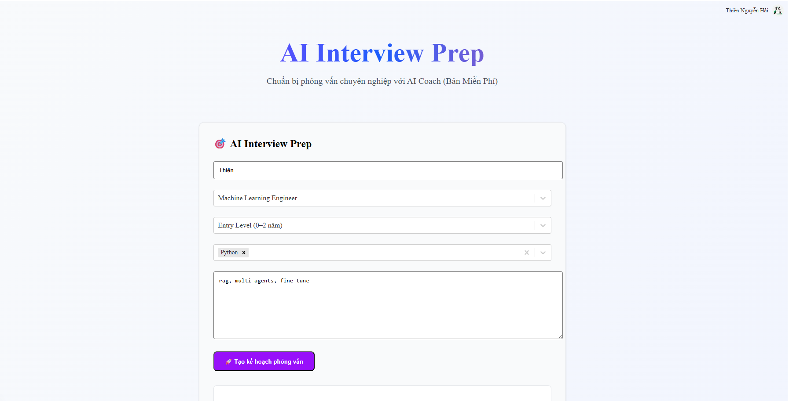
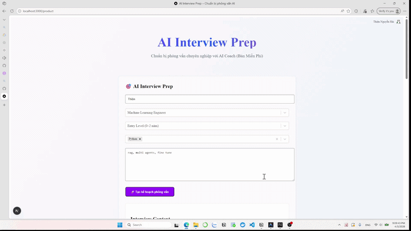

# AI Interview Prep SaaS

AI Interview Prep SaaS is a production-grade AI-powered platform designed to help job seekers prepare for interviews with high-quality, personalized content. The system leverages OpenAI's GPT models to generate tailored interview questions, technical briefs, and preparation strategies based on the user's specific role, experience level, and target company.

---

## Project Status

**Status: Active (Production Ready)**

| Layer | Status | Description |
|-------|--------|-------------|
| **Frontend** |  | Next.js 16 + React 19 + Tailwind CSS 4 |
| **Backend** |  | FastAPI + OpenAI Streaming |
| **Auth** |  | Integrated with @clerk/nextjs |

---

## System Architecture

### Overall Interface



### Interview Preparation Flow



### Product Demo



---

## Table of Contents

1. [Features](#1-features)
2. [Architecture](#2-architecture)
3. [Project Structure](#3-project-structure)
4. [Prerequisites](#4-prerequisites)
5. [Installation and Setup](#5-installation-and-setup)
6. [API Overview](#6-api-overview)

---

## 1. Features

- **AI-Powered Question Generation**: Leverages GPT-4o-mini to generate context-aware interview questions based on job description and user profile.
- **Streaming Responses**: Real-time content generation using Server-Sent Events (SSE) for a smooth user experience.
- **Role-Based Customization**: Tailors content based on target company, technical skills, and years of experience.
- **Secure Authentication**: Full user management and protected routes using Clerk.
- **Modern Responsive UI**: Built with the latest React 19 and Tailwind CSS 4 for a premium aesthetic.

---

## 2. Architecture

### Backend (FastAPI)

The backend is built with FastAPI and handles the core AI orchestration:
1. **Schema Validation**: Uses Pydantic to validate complex interview profiles.
2. **Streaming Service**: Streams OpenAI completions directly to the client using `StreamingResponse`.
3. **Auth Guard**: Implements Clerk JWT verification to secure API endpoints.

### Tech Stack

- **AI/LLM**: OpenAI GPT-4o-mini.
- **Backend**: FastAPI, Uvicorn, Python 3.12.
- **Frontend**: Next.js 16 (App Router), React 19, Tailwind CSS 4.
- **Auth**: Clerk (Next.js & FastAPI).

---

## 3. Project Structure

```text
AI_Interview_Prep_SaaS/
├── assets/                     # Media and demo assets
│   ├── images/                 # Demo screenshots (home.png, prepare.png)
│   └── videos/                 # Product demo videos
├── backend/                    # FastAPI Backend
│   ├── app/
│   │   ├── api/                # API Endpoints (interview)
│   │   ├── services/           # AI Logic (OpenAI streaming)
│   │   ├── schemas/            # Pydantic models
│   │   └── prompts/            # AI Prompt templates
│   ├── .env                    # Environment variables
│   └── requirements.txt        # Python dependencies
├── frontend/                   # Next.js Frontend
│   ├── app/                    # Next.js 16 App Router
│   ├── components/             # Reusable UI components
│   ├── .env.local              # Frontend environment variables
│   └── package.json            # Node.js dependencies
└── README.md                   # Project documentation
```

---

## 4. Prerequisites

- **Python 3.12+** (Anaconda recommended)
- **Node.js 18+**
- **OpenAI API Key**
- **Clerk Account** (Publishable Key and Secret Key)

---

## 5. Installation and Setup

### Step 1: Clone the Repository

```bash
git clone https://github.com/adamwhite625/AI_Interview_Prep_SaaS.git
cd AI_Interview_Prep_SaaS
```

### Step 2: Backend Setup (Anaconda)

```bash
# Create and activate environment
conda create -n ai_interview python=3.12 -y
conda activate ai_interview

# Install dependencies
cd backend
pip install -r requirements.txt

# Setup environment variables
cp .env.example .env
# Edit .env and fill in your keys:
# OPENAI_API_KEY=your_openai_api_key
# CLERK_JWKS_URL=your_clerk_jwks_url
```

### Step 3: Frontend Setup

```bash
cd ../frontend
npm install

# Setup environment variables
cp .env.example .env.local
# Edit .env.local and fill in your keys:
# NEXT_PUBLIC_CLERK_PUBLISHABLE_KEY=your_publishable_key
# CLERK_SECRET_KEY=your_secret_key
```

### Step 4: Run the Application

**Start the Backend:**
```bash
cd ../backend
uvicorn app.main:app --reload
```

**Start the Frontend:**
```bash
cd ../frontend
npm run dev
```

The application will be available at `http://localhost:3000`.

---

## 6. API Overview

All API requests are prefixed with `/api`.

| Category | Endpoint | Action |
|----------|----------|--------|
| **Health** | `GET /health` | Check API status |
| **Interview** | `POST /interview` | Generate and stream interview preparation content |

The `/interview` endpoint expects an `InterviewPrep` object and returns a `text/event-stream`.
